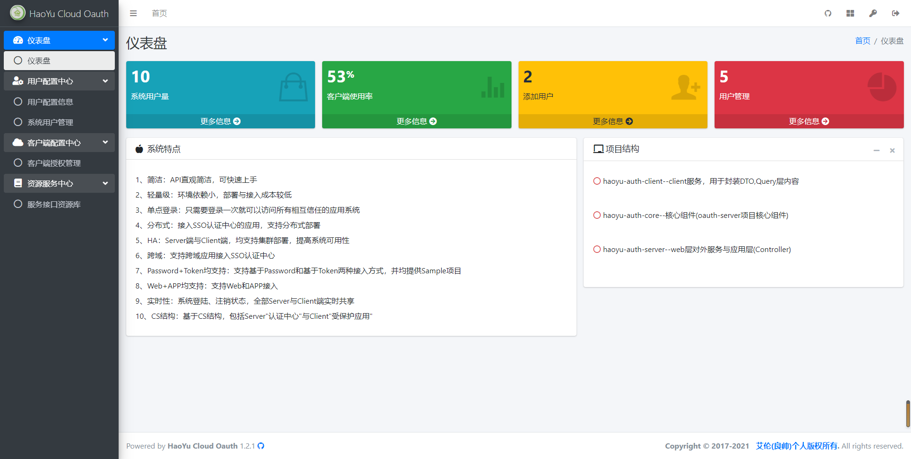

# medusa-auth-sso
### <b>分布式统一单点登录平台</b>

# 一、简介

## 1.1 概述

medusa-auth-sso是一个分布式单点登录平台。是基于haoyu-auth衍生出的SSO登录平台，与haoyu-auth主要区别在于
此为独立SSO体系架构，基于JWK集成系统用户，不依赖于其他平台，同时可扩展支持自定义授权登录、第三方登录等功能的实现，
但无法实现haoyu-auth那样支持不同数据库的不同用户认证体系，而是统一的用户认证体系，
但都是只需要登录一次就可以访问所有相互信任的应用系统。 拥有"轻量级、分布式、跨域、Password+Token均支持、Web+APP均支持"等特性。

## 1.2 特性

1、简洁：API直观简洁，可快速上手

2、轻量级：环境依赖小，部署与接入成本较低

3、单点登录：只需要登录一次就可以访问所有相互信任的应用系统

4、分布式：接入SSO认证中心的应用，支持分布式部署

5、HA：Server端与Client端，均支持集群部署，提高系统可用性

6、跨域：支持跨域应用接入SSO认证中心

7、Password+Token均支持：支持基于Password和基于Token两种接入方式，并均提供Sample项目

8、Web+APP均支持：支持Web和APP接入

9、实时性：系统登陆、注销状态，全部Server与Client端实时共享

10、CS结构：基于CS结构，包括Server"认证中心"与Client"受保护应用"

## 1.3 环境

### 1)、硬件环境

1、CentOS: 7.6

2、Docker: 18.09

### 2)、软件环境

1、JDK：1.8+

2、Redis：5.0+

3、Mybatis Plus 3.4.3

# 2 项目结构
```
├─medusa-auth-sso
|  |
│  ├─medusa-auth-client---------------------------------client服务，用于封装DTO,Query层内容
|  |
│  ├─medusa-auth-core---------------------------------核心组件(用于应用Oauth-server项目的核心组件)
|  |
|  ├─medusa-auth-server---------------------------------web层对外服务与应用层(Controller)

```
# 3 系统主界面


# 4 补充说明-关于刷新Token的说明
目前系统支持: 授权码（authorization-code）, 隐藏式（implicit）, 密码式（password）, 客户端凭证（client credentials）四种模式，
但其中implicit不常用，另外客户端凭证是不支持刷新Token的，按官方文档说明这个类型是不需要refresh_token的，但可通过setAllowRefresh来开启.

# 5 数据库表说明
https://andaily.com/spring-oauth-server/db_table_description.html

# 6 参考文章
https://blog.csdn.net/liuerchong/article/details/117154612